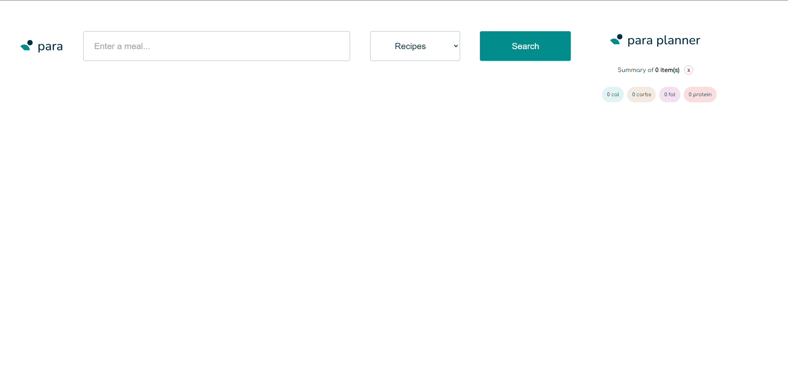
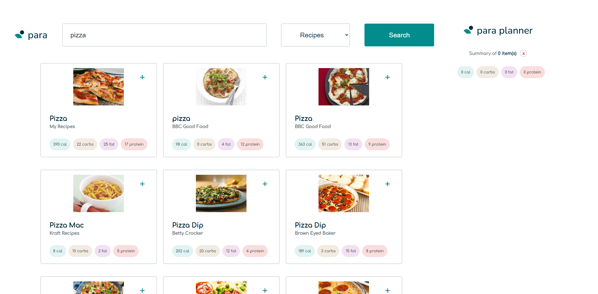
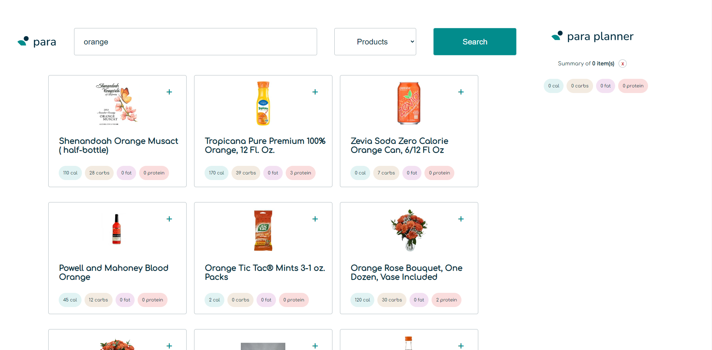
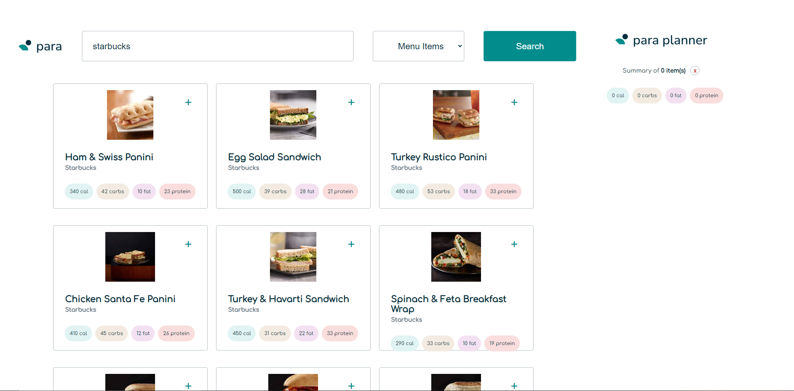
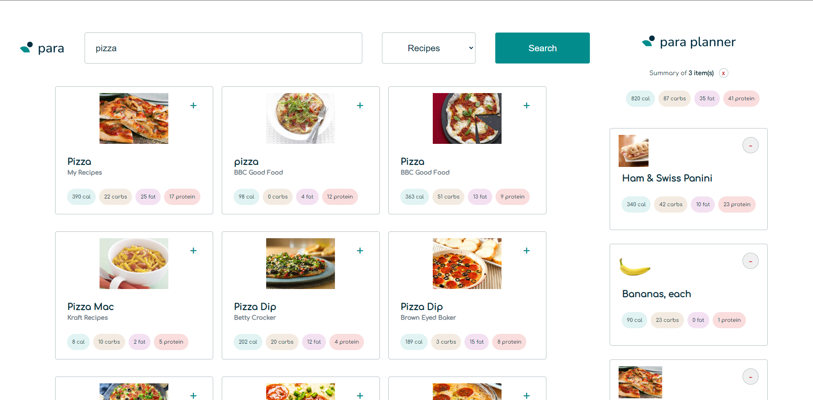
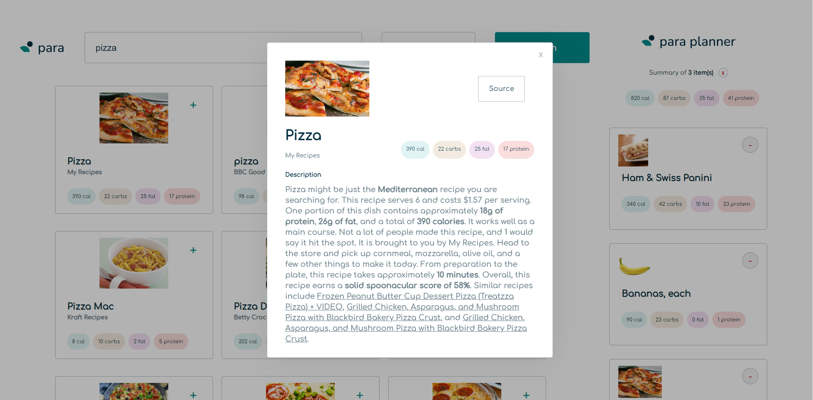
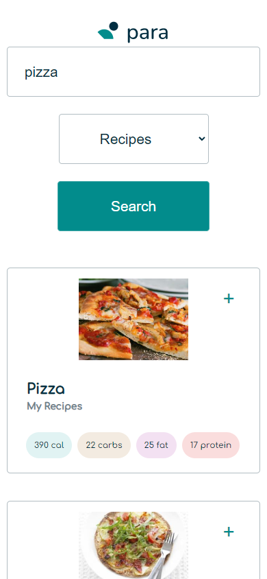

# Para - Food Tracking App

Welcome to Para, a food tracking app that helps you discover new recipes!

View the deployed app here: https://para-tracker.netlify.app/

Project Descripiton: Users can search for recipes, products, or menu items and view the calories and macro nutrients for each item. Recipes gathers different recipes using the Spoonacular API and allows you to discover new meals. Products display grocery store items such as bananas or apples, and menu items display information from restaurants such as a big mac from mcdonalds. Users can click on an individual meal to open a modal which displays more in depth information including the recipe instructions. Users can also add and remove food items to a daily planner which keeps track of your total calories and macros.

The features of the app include:
- Search for a recipe, menu item, or product
- View calories and macro nutrients for each food item and
- View in-depth information about each food item by clicking and opening the modal
- Add and remove food items from the daily planner

Some feature I would like to include in the future:
- Loading screen when searching for food items
- Empty screen when no search results are present
- Ability to save daily planner to local storage
- Ability to view past daily planners

## Local Build
### `npm start`

Runs the app in the development mode.\
Open [http://localhost:3000](http://localhost:3000) to view it in the browser.

## Screenshots

The app with no search results

The app with recipes search result

The app with products search result

The app with menu items search result

The app with items in the daily planner

The app with the modal screen open

The app on a mobile device

